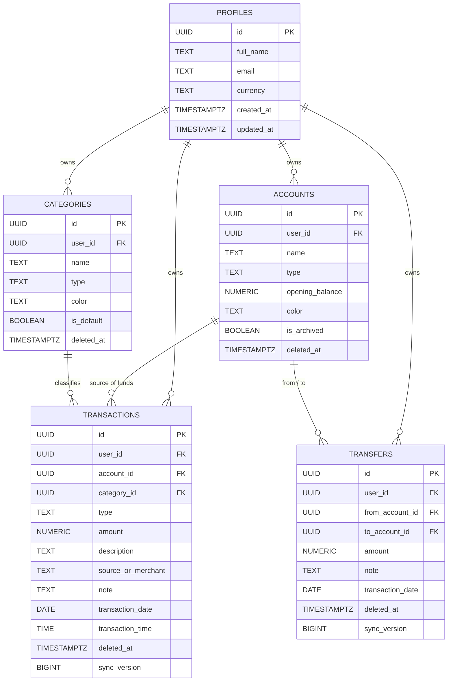

# MoneyFlow Database Documentation

## 1. PostgreSQL Schema Overview

The database is built on PostgreSQL via Supabase. All personal financial records are strictly isolated by `user_id` referencing `auth.users(id)`.



---

## 2. Table Specifications

### 2.1 `profiles`
Stores user profile information and primary currency preference.
- `id` (UUID, Primary Key): Foreign key to `auth.users(id) ON DELETE CASCADE`.
- `full_name` (TEXT): Display name.
- `email` (TEXT): Account email.
- `currency` (TEXT): ISO currency code (Default `'INR'`).
- `avatar_url` (TEXT): Optional profile picture URL.
- `created_at`, `updated_at` (TIMESTAMPTZ).

### 2.2 `accounts` (Money Locations)
Represents where money physically exists (Cash, Bank, UPI, Credit Cards).
- `id` (UUID, Primary Key): Generated client-side or server-side.
- `user_id` (UUID): Owner user ID.
- `name` (TEXT): e.g. "Cash", "HDFC Bank", "UPI".
- `type` (TEXT): `'CASH'`, `'BANK'`, `'UPI'`, `'WALLET'`, `'CREDIT_CARD'`, `'OTHER'`.
- `opening_balance` (NUMERIC(14,2)): Initial balance when the account was created.
- `color` (TEXT): Hex color tag.
- `is_archived` (BOOLEAN): Soft archive flag.
- `deleted_at` (TIMESTAMPTZ): Soft delete timestamp.

### 2.3 `categories`
Used for classifying Money Out (and Money In).
- `id` (UUID, Primary Key).
- `user_id` (UUID): Owner user ID.
- `name` (TEXT): e.g. "Food", "Shopping", "Salary".
- `type` (TEXT): `'INCOME'`, `'EXPENSE'`, or `'BOTH'`.
- `icon` (TEXT): Icon identifier.
- `color` (TEXT): Color badge.
- `is_default` (BOOLEAN): True for pre-seeded system categories.
- `deleted_at` (TIMESTAMPTZ): Soft delete timestamp.

### 2.4 `transactions`
The central ledger of Money In and Money Out.
- `id` (UUID, Primary Key): Client-generated UUID.
- `user_id` (UUID): Owner user ID.
- `account_id` (UUID): Target money location.
- `type` (TEXT): `'CREDIT'` (Money In) or `'DEBIT'` (Money Out).
- `amount` (NUMERIC(14,2)): Positive currency amount.
- `category_id` (UUID): Optional category link.
- `description` (TEXT): Activity label.
- `source_or_merchant` (TEXT): e.g. "Rahul", "XYZ Store".
- `note` (TEXT): Optional user details.
- `transaction_date` (DATE): Format `YYYY-MM-DD`.
- `transaction_time` (TIME): Optional time of transaction.
- `deleted_at` (TIMESTAMPTZ): Null if active; set upon deletion.
- `sync_version` (BIGINT): Incremented on updates for conflict resolution.

### 2.5 `transfers`
Dedicated table for money movements between user's own accounts.
- `id` (UUID, Primary Key).
- `user_id` (UUID).
- `from_account_id` (UUID): Source account.
- `to_account_id` (UUID): Destination account.
- `amount` (NUMERIC(14,2)): Transfer amount.
- `note` (TEXT): Optional transfer note.
- `transaction_date` (DATE): Date of movement.
- `deleted_at` (TIMESTAMPTZ): Soft deletion marker.
- `sync_version` (BIGINT).
- **Constraint**: `chk_different_accounts CHECK (from_account_id <> to_account_id)`.

---

## 3. High-Performance Indexes

```sql
-- Accounts & Categories
CREATE INDEX idx_accounts_user_id ON accounts(user_id) WHERE deleted_at IS NULL;
CREATE INDEX idx_categories_user_id ON categories(user_id) WHERE deleted_at IS NULL;

-- Chronological Timeline Queries
CREATE INDEX idx_transactions_user_date ON transactions(user_id, transaction_date DESC) WHERE deleted_at IS NULL;
CREATE INDEX idx_transactions_user_account_date ON transactions(user_id, account_id, transaction_date DESC) WHERE deleted_at IS NULL;
CREATE INDEX idx_transactions_user_type_date ON transactions(user_id, type, transaction_date DESC) WHERE deleted_at IS NULL;
CREATE INDEX idx_transactions_category_id ON transactions(user_id, category_id) WHERE deleted_at IS NULL;
CREATE INDEX idx_transactions_updated_at ON transactions(user_id, updated_at DESC);

-- Transfers
CREATE INDEX idx_transfers_user_date ON transfers(user_id, transaction_date DESC) WHERE deleted_at IS NULL;
CREATE INDEX idx_transfers_from_account ON transfers(user_id, from_account_id) WHERE deleted_at IS NULL;
CREATE INDEX idx_transfers_to_account ON transfers(user_id, to_account_id) WHERE deleted_at IS NULL;
```

---

## 4. Row Level Security (RLS)

Every user-owned table has Row Level Security enabled.
```sql
ALTER TABLE profiles ENABLE ROW LEVEL SECURITY;
ALTER TABLE accounts ENABLE ROW LEVEL SECURITY;
ALTER TABLE categories ENABLE ROW LEVEL SECURITY;
ALTER TABLE transactions ENABLE ROW LEVEL SECURITY;
ALTER TABLE transfers ENABLE ROW LEVEL SECURITY;
```

All SELECT, INSERT, UPDATE, and DELETE policies enforce:
```sql
USING (auth.uid() = user_id)
WITH CHECK (auth.uid() = user_id);
```
No user can view or modify records belonging to any other user under any circumstance.

---

## 5. Automatic User Initialization Trigger

When a new user signs up via Supabase Auth (`auth.users`), the `handle_new_user()` trigger automatically executes:
1. Creates the `profiles` record.
2. Seeds default Income categories: *Salary, Freelance, Business, Gift, Refund, Cashback, Interest, Other*.
3. Seeds default Expense categories: *Food, Shopping, Travel, Fuel, Bills, Entertainment, Health, Subscriptions, Education, Home, Personal, Business, Other*.
4. Seeds default Money Locations: *Cash (₹0.00), HDFC Bank (₹0.00), UPI (₹0.00)*.
